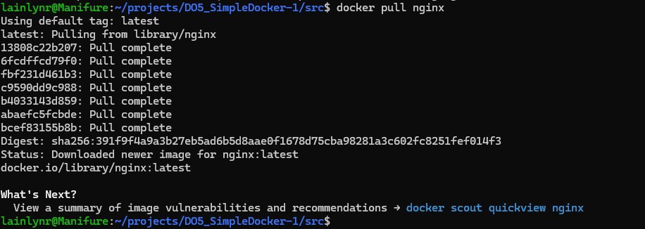

## Part 1. Готовый докер
- Возьми официальный докер-образ с nginx и выкачай его при помощи docker pull.

- Проверь наличие докер-образа через docker images.
.png)
- Запусти докер-образ через docker run -d [image_id|repository]. Проверь, что образ запустился через docker ps.
.png)
- Посмотри информацию о контейнере через docker inspect [container_id|container_name].
.png)
- Останови докер образ через docker stop [container_id|container_name]. Проверь, что образ остановился через docker ps.
.png)
- Запусти докер с портами 80 и 443 в контейнере, замапленными на такие же порты на локальной машине, через команду run.
.png)
- Проверь, что в браузере по адресу localhost:80 доступна стартовая страница nginx.
.png)
- Перезапусти докер контейнер через docker restart [container_id|container_name].
.png)

## Part 2. Операции с контейнером
- Прочитай конфигурационный файл nginx.conf внутри докер контейнера через команду exec.
.png)
- Создай на локальной машине файл nginx.conf. Настрой в нем по пути /status отдачу страницы статуса сервера nginx.
.png)
- Скопируй созданный файл nginx.conf внутрь докер-образа через команду docker cp.
.png)
- Перезапусти nginx внутри докер-образа через команду exec.
.png)
- Проверь, что по адресу localhost:80/status отдается страничка со статусом сервера nginx.
.png)
- Экспортируй контейнер в файл container.tar через команду export.
.png)
- Останови контейнер.
.png)
- Удали образ через docker rmi [image_id|repository], не удаляя перед этим контейнеры.
.png)
- Удали остановленный контейнер.
.png)
- Импортируй контейнер обратно через команду import. Запусти импортированный контейнер.
.png)
- Проверь, что по адресу localhost:80/status отдается страничка со статусом сервера nginx.
.png)

## Part 3. Мини веб-сервер
- .png)
- .png)

## Part 4. Свой докер
- .png)
- .png)
- .png)
- .png)
- .png)
- .png)
- .png)

## Part 5. Dockle
- .png)
- .png)
- .png)

## Part 6. Базовый Docker Compose

- .png)
- .png)
- .png)