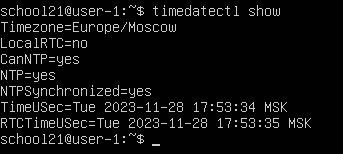
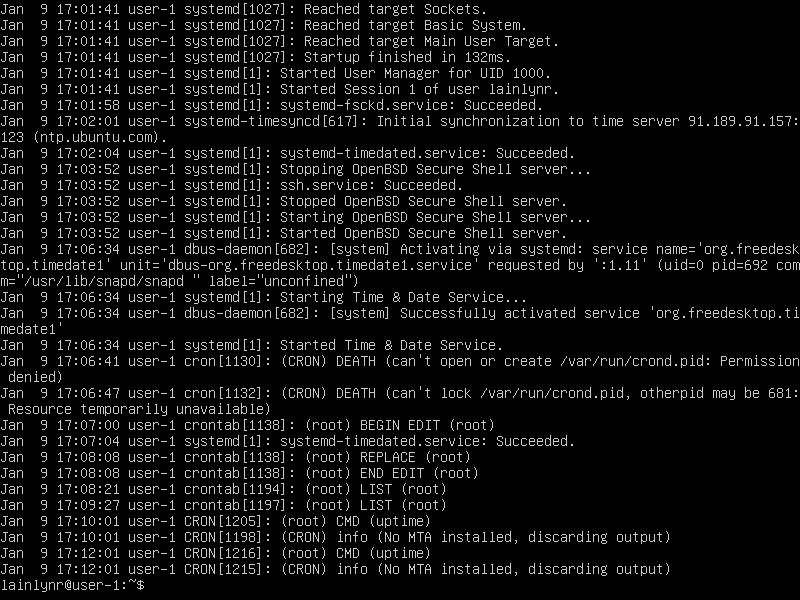

## Part 1. Установка ОС

Команда для вывода версии Ubuntu

## Part 2. Создание пользователя
создал пользователя *school21*

Вызов команды для создания пользователя

---

Вывод команды cat /etc/passwd
пользователь *school21* добавлен в группу adm

## Part 3. Настройка сети ОС

Интерфейс lo создается при загрузке операционной системы и предназначен для обеспечения обратной связи (loopback) с самим компьютером.

---

DHCP - "Dynamic Host Configuration Protocol" (Протокол динамической конфигурации хоста)

---

Для изменения названия машины, была использована команда *sudo hostnamectl set-hostname user-1*

Временная зона была изменена с помощью команды *sudo timedatectl set-timezone Europe/Moscow*

Вывод названия сетевых интерфейсов и ip адресса устройства с помощью команды ifconfig

Внешний IP-адрес шлюза выводится командой *curl ipinfo.io/ip*

Внутренний IP-адрес шлюза выводится командой *ip route | grep default*

Я задал статичне настройки ip,gw,dns с помощью редактирования файла *00-installer-config.yaml* 

и применил настройки с помощью *sudo netplan apply*

После перезагрузки с помощью *sudo reboot* все настройки соответствую заданным

---

## Part 4. Обновление ОС

## Part 5. Использование команды sudo
Команда sudo предоставляет пользователю контроллируемый доступ к командам суперпользователя (root)

---

## Part 6. Установка и настройка службы времени

## Part 7. Установка и использование текстовых редакторов
Я использовал редакторы *nano,vim,joe*

---

в vim для сохранения и выхода нужно ввести *:w* и *:q*

В nano для сохранения и выхода нужно прожать *CTRL+O* и *CTRL+X*

В joe для сохранения и выхода нужно нажать *CTRL+k* и затем *X*

---

В vim для выхода без сохранения необходимо ввести *:q!*

В nano для выхода без сохранения необходимо нажать *CTRL+X* и *N*

В joe для выхода без сохранения необходимо нажать *CTRL+C* и *N*

---

В vim для поиска и замены необходимо ввести *:%s/искать/заменить/g*

В nano для поиска и замены необходимо нажать *Ctrl+\*

В joe для поиска и замены необходимо нажать *^G*

## Part 8. Установка и базовая настройка сервиса SSHD

---

Установил SSHd командой sudo apt install openssh-server.

---

Обычно, служба автоматически добавляется к автозапуску, но если этого не произошло, это можно сделать с помощью команды sudo systemctl enable sshd

---

Для изменения порта необходимо отредактировать файл конфигурации /etc/ssh/sshd_config.

---

Команда ps в Linux используется для отображения информации о процессах, запущенных в операционной системе.

Для отоброжения процесса sshd можно ввести команду *ps -C sshd*

 Опция -C позволяет указать имя конкретного процесса для отображения.

---

---

-t: Этот ключ отображает только TCP-соединения.

-a: отображает все (ALL) сетевые соединения и прослушивающие (listening) порты.

-n: Этот ключ выводит числовые значения вместо имен (например, IP-адресов вместо их соответствующих символьных имен).

tcp: Указывает на протокол

0: Это состояние соединения. В данном контексте две цифры 0 означают, что соединение активно.

0.0.0.0:2022: Это адрес и порт.

LISTEN: Это состояние прослушивания.

---

## Part 9. Установка и использование утилит top, htop

---

- Вывод команды top:
  - uptime - 24 min
  - количество авторизованных пользователей - 1
  - общую загрузку системы - 0.02
  - общее количество процессов - 103
  - загрузку cpu - 0.0
  - загрузку памяти - 0.0
  - pid процесса занимающего больше всего памяти - 1
  - pid процесса, занимающего больше всего процессорного времени - 13

- Вывод команды htop:
  - 
  - 
  - 
  - 

---

## Part 10. Использование утилиты **fdisk**

## Part 11. Использование утилиты **df** 

##### Команда df.  
- Корневой раздел (/):
  - размер раздела: 10218772 байт.
  - размер занятого пространства: 2690808 байт.
  - размер свободного пространства: 6987292 байт.
  - процент использования: 28%

##### Команда df -Th.
- Корневой раздел (/):
    - размер раздела: 9.8 Гигабайт.
    - размер занятого пространства: 2.6 Гигабайт.
    - размер свободного пространства: 6.7 Гигабайт.
    - процент использования: 28%
- Тип файловой системы - ext4

## Part 12. Использование утилиты **du**

-
  - 
  - 
  - 

## Part 13. Установка и использование утилиты **ncdu**

-
  - 
  - 

## Part 14. Работа с системными журналами

- 17:01:41. Lainlynr.  LOGIN.
- 

## Part 15. Использование планировщика заданий **CRON**

- 
- 

- 