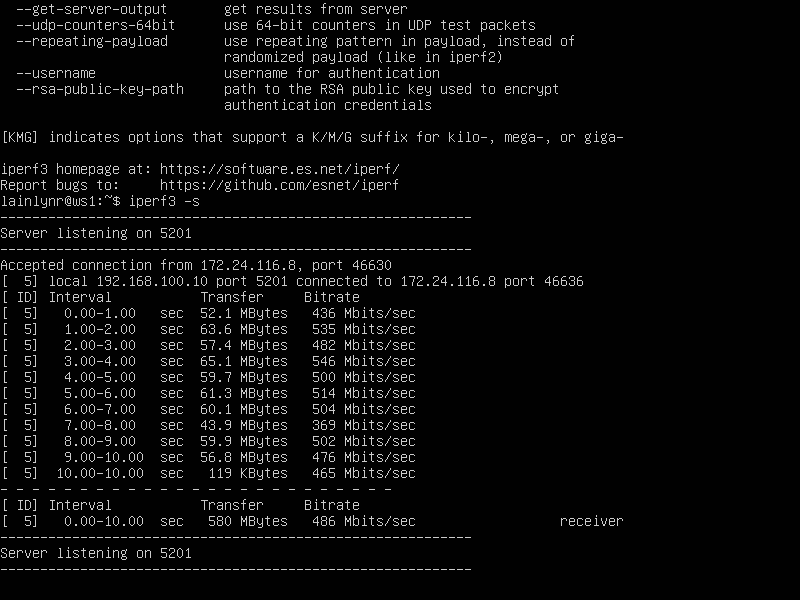
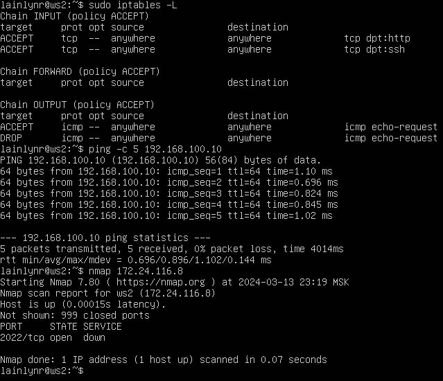
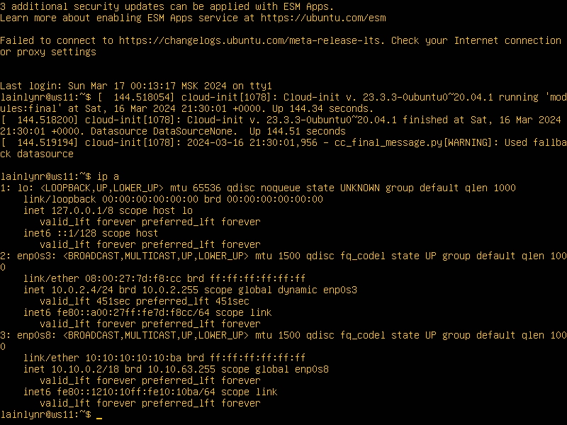

## Part 1. Инструмент ipcalc
#### 1.1. Сети и маски
- 1. Адрес сети - *192.167.38.54*
- 2. - *255.255.255.0* в двоичной - *11111111.11111111.11111111.00000000* / в префиксной - */24*
     - */15* в обычном виде - *255.254.0.0* / в двоичном - *11111111.11111110.00000000.00000000*
     - *11111111.11111111.11111111.11110000* в обычном виде - *255.255.255.240* / в префиксном - */28*
- 3. - */8* Минимальный - *12.0.0.1* / Максимальный - *12.255.255.254*
     - *11111111.11111111.00000000.00000000* Минимальный - *12.167.0.1* / Максимальный *12.167.255.254*
     - *255.255.254.0* Минимальный - *12.167.38.1* / Максимальный - *12.167.39.254*
     - */4* Минимальный - *0.0.0.1* / Максимальный - *15.255.255.254*
#### 1.2. localhost
Можно ли обратиться к приложению, работающему на localhost, со следующими IP:
   - 194.34.23.100 - нет
   - 127.0.0.2 - да
   - 127.1.0.1 - да
   - 128.0.0.1 - нет
#### 1.3. Диапазоны и сегменты сетей
- 1. 
     - В качестве публичных IP можно использовать:
          - 134.43.0.2
          - 172.0.2.1
          - 192.172.0.1
          - 172.68.0.2
          - 192.169.168.1
     - В качестве частных IP можно использовать:
          - 10.0.0.45
          - 192.168.4.2
          - 172.20.250.4
          - 172.16.255.255
          - 10.10.10.10
- 2. 
     - Диапазон возможных адресов: 10.0.0.1 - 10.10.63.254
     - Возможные адреса: 10.0.0.1, 10.10.0.2, 10.10.10.10
     - Невозможные адреса: 10.10.100.1, 10.10.1.255
## Part 2. Статическая маршрутизация между двумя машинами
- 2. 
     - 
     - 

     - 
     - 
- 2.1.
     - 
     - 
     - 
     - 
- 2.2.
     - 
     - 
     - 
     - 
## Part 3. Утилита iperf3
#### 3.1. Скорость соединения
- 8 Mbps = 1 MB/s
- 100 MB/s = 800000 Kbps
- 1 Gbps = 1000 Mbps
#### 3.2. Утилита iperf3
- 
- 

## Part 4. Сетевой экран

#### 4.1. Утилита iptables

- 
- 

> В файлах ```/etc/firewall.sh``` был использован флаг
```-j``` - выбрать действие, если правило подошло. <br>
> Таким образом, при обработке правил сверху-вниз при совпадении описанных условий применяется то правило, что расположено выше. <br>
> Из-за того, что в файле ws1 запрещающее правило находится выше разрешающего, виртуальная машина 1 не может пропинговать виртуальную машину 2. <br>
> Для виртуальной машины 2 ситуация противоположная, поскольку разрешающее правило выше запрещающего.

#### 4.2. Утилита nmap

- 
- 

## Part 5. Статическая маршрутизация сети
#### 5.1. Настройка адресов машин
- настройка конфигурации:
- 
- 
- 
- 
- 
- ip -4 a
- 
- 
- 
- 
- 
- ping
- 
- 

#### 5.2. Включение переадресации IP-адресов

- 
- 

- 
- 

#### 5.3. Установка маршрута по-умолчанию

- 
- 
- 

- 
- 
- 

- 

#### 5.4. Добавление статических маршрутов

- 
- 
- 

- Для адреса 10.10.0.0/18 был выбран маршрут, отличный от 0.0.0.0/0, потому что при наличии нескольких маршрутов одинаковой длины выбирается тот маршрут, который задан наиболее точно.

#### 5.5. Построение списка маршрутизаторов

- 

-Утилита Traceroute вместо ICMP-запроса отправляет 3 UDP-пакета на определенный порт целевого хоста и ожидает ответа о недоступности этого порта. Первый пакет отправляется с TTL=1, второй с TTL=2 и так далее, пока запрос не попадёт адресату. Так как вместо ICMP-запроса он отправляет UDP-запрос, в каждом запросе есть порт отправителя и порт получателя. По умолчанию запрос отправляется на закрытый порт 34434. Когда запрос попадёт на хост назначения, этот хост отправит ответ о недоступности порта «Destination port unreachable» (порт назначения недоступен). Это значит, что адресат получил запрос. Traceroute воспримет этот ответ как завершение трассировки.

#### 5.6. Использование протокола ICMP при маршрутизации

- 
- 

## Part 6. Динамическая настройка IP с помощью DHCP

- 
- 
- 
- 
- 
- 
- 
- 

- Какими опциями DHCP сервера пользовались в данном пункте:

Настройка конфигурации службы DHCP (адрес маршрутизатора по-умолчанию, DNS-сервер, адрес внутренней сети, привязка к MAC-адресу)

Клиент протокола динамической конфигурации хоста (команда dhclient) для обновления или освобождения IP-адреса

## Part 7. NAT

- 
- 
- 
- 

- 
- 
- 
- 
- 

- 

## Part 8. Дополнительно. Знакомство с SSH Tunnels

- Запускаем фаервол на r2

- Запускаем Apache на r2 на localhost:80

- 

- Воспользоваться Local TCP forwarding с ws21 до ws22, чтобы получить доступ к веб-серверу на ws22 с ws21

- .png)

- Воспользоваться Remote TCP forwarding c ws11 до ws22, чтобы получить доступ к веб-серверу на ws22 с ws11
- 
- Проверяем на ws11
- 
- Проверяем на ws21
- 